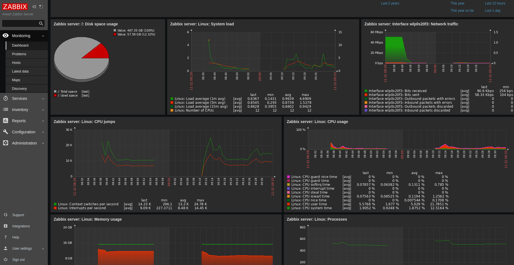
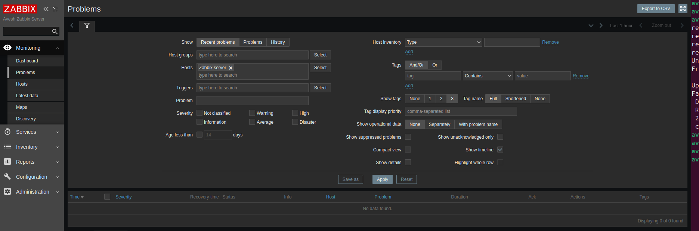
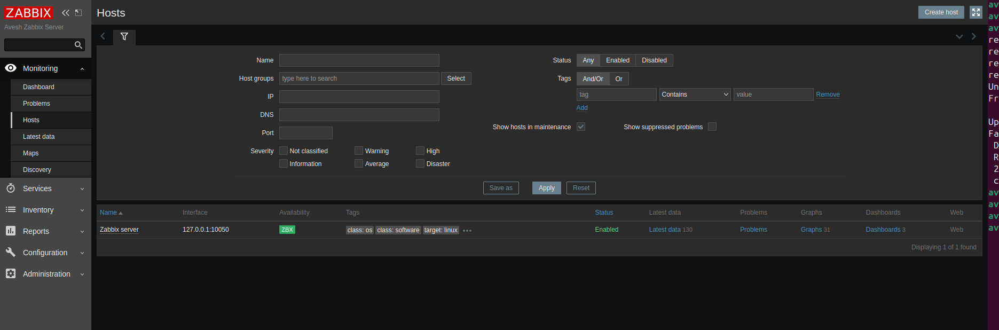
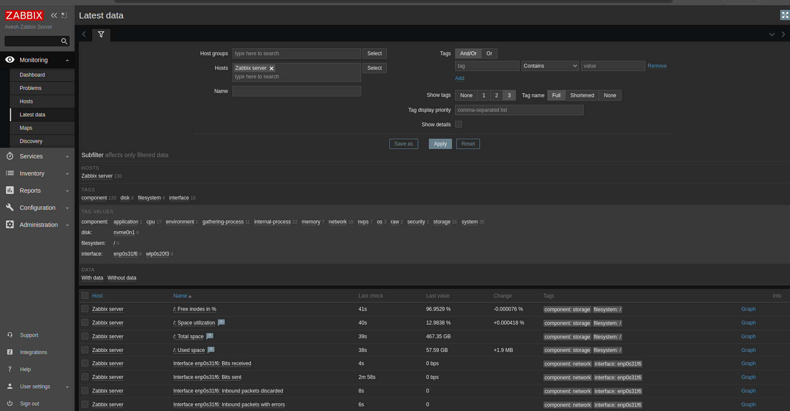
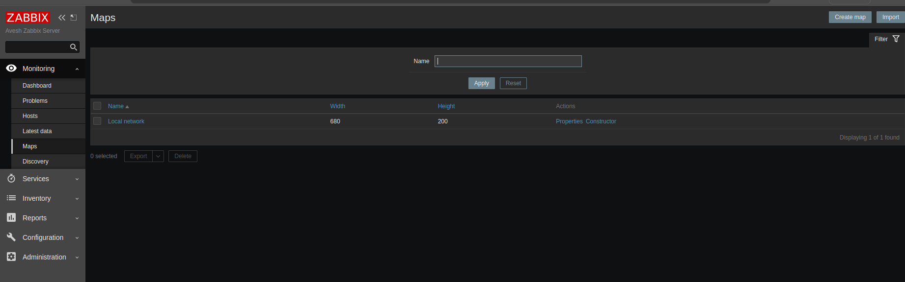
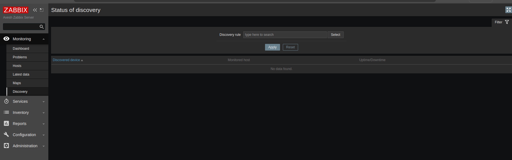

# ⚡ Overview For Zabbix Dashboard
## Monitoring
├── Dashboard  
├── Problems  
├── Hosts  
├── Latest Data  
├── Maps  
└── Discovery

### Dashboard
- Central overview page with customizable widgets
- Widgets display summaries, maps, graphs, trigger statuses, host availability, clocks, etc.
- Multiple dashboards and pages supported, with slideshow rotation
- Used for quick visual assessment of monitored environment status

### Problems
- Lists ongoing issues detected by Zabbix triggers
- Shows problem severity, affected hosts, timestamps
- Crucial for identifying and addressing incidents quickly

### Hosts
- Displays all monitored hosts/devices
- Shows host status, availability, and item configurations
- Provides drill-down access to host-specific metrics and monitoring data

### Latest Data
- Presents the most recent monitoring data collected from hosts
- Useful for real-time verification of performance metrics (CPU, memory, network, etc.)

### Maps
- Visual network or logical maps showing hosts, network links, and problem states
- Helps in understanding network topology and impact of issues

### Discovery
- Automated detection system for network devices and services
- Uses discovery rules to add new hosts/items automatically
- Facilitates efficient management of dynamic, large networks

---
