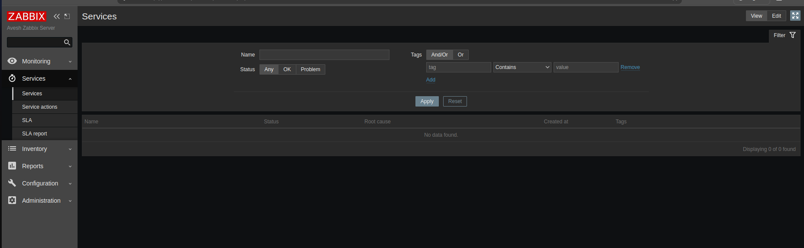
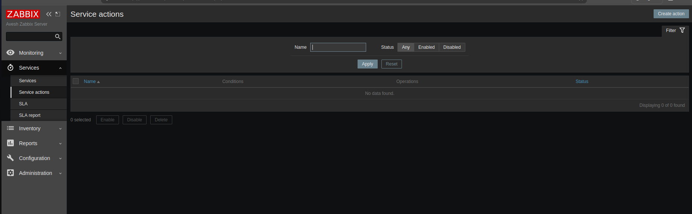
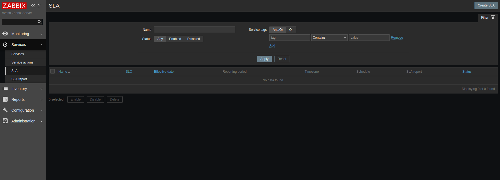
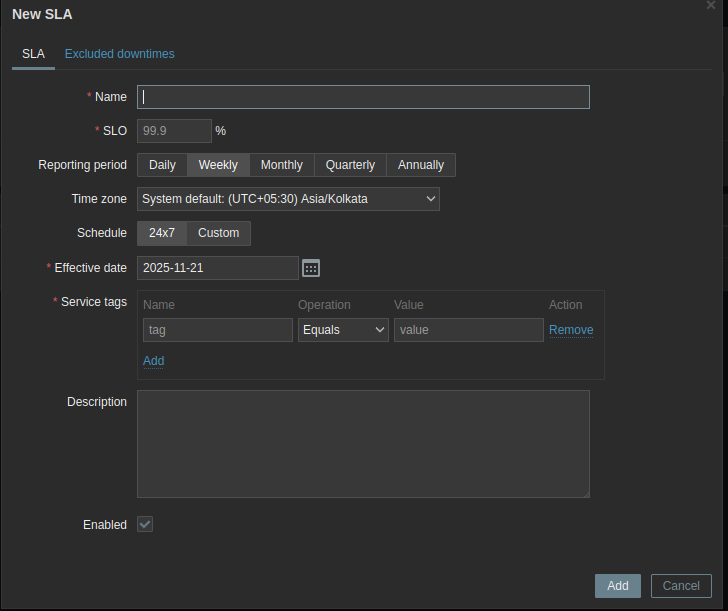
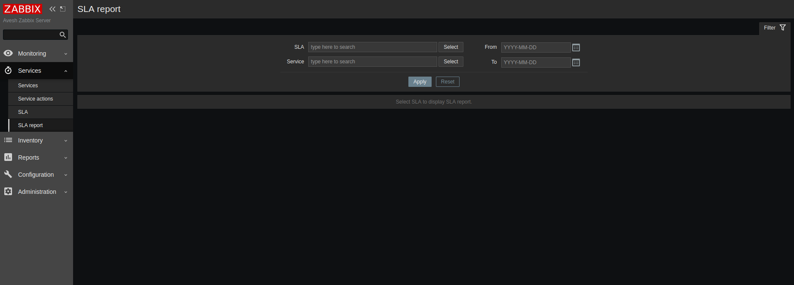

# ⚡ Overview For Zabbix Dashboard
## Monitoring
├── Dashboard  
├── Problems  
├── Hosts  
├── Latest Data  
├── Maps  
└── Discovery

### Dashboard
- Central overview page with customizable widgets
- Widgets display summaries, maps, graphs, trigger statuses, host availability, clocks, etc.
- Multiple dashboards and pages supported, with slideshow rotation
- Used for quick visual assessment of monitored environment status

### Problems
- Lists ongoing issues detected by Zabbix triggers
- Shows problem severity, affected hosts, timestamps
- Crucial for identifying and addressing incidents quickly

### Hosts
- Displays all monitored hosts/devices
- Shows host status, availability, and item configurations
- Provides drill-down access to host-specific metrics and monitoring data

### Latest Data
- Presents the most recent monitoring data collected from hosts
- Useful for real-time verification of performance metrics (CPU, memory, network, etc.)

### Maps
- Visual network or logical maps showing hosts, network links, and problem states
- Helps in understanding network topology and impact of issues

### Discovery
- Automated detection system for network devices and services
- Uses discovery rules to add new hosts/items automatically
- Facilitates efficient management of dynamic, large networks

---
## Services
├── services
├── Service Action 
├── SLA
└── SLA report

# Services and SLA Overview in Zabbix

## Services
- Represent IT and business services monitored in Zabbix.
- Services can be organized in a tree structure (parent/child relationships).
- Service status is computed based on the status of child services using configurable rules.
- Service problem data is used for SLA calculation and reporting.

## Service Action
- Optional configuration allowing automated actions to respond to service status changes.
- Can send notifications or execute custom scripts when service problems occur.
- Helps automate incident response linked to service degradation or failure.

## SLA (Service Level Agreement)
- Defines Service Level Objective (SLO), expected uptime schedules, and planned downtimes.
- Configured in the *Services → SLA* menu section.
- SLAs are matched to services via service tags.
- One SLA may apply to multiple services; one service may have multiple SLAs.
- SLA parameters include:
  - Name: SLA name
  - SLO: Service level objective as a percentage (e.g. 99.9%)
  - Reporting period: Daily, weekly, monthly, quarterly, or yearly
  - Time zone: Time zone for SLA calculations
  - Schedule: 24x7 or custom uptime periods
  - Effective date: When SLA calculations start
  - Service tags: Tags that associate SLA with services
  - Excluded downtimes: Maintenance/periods not counted against SLA

## SLA Report
- Provides insights on real service availability (Service Level Indicator, SLI).
- Compares SLI with SLO to determine if SLA targets are met.
- Accessible via *Services → SLA report* section.
- Reports can be generated for various periods and service groupings.

---
## Inventory
├── Overview 
└── Hosts

# Inventory in Zabbix

## Overview
- Displays aggregated host inventory data grouped by chosen fields.
- Provides a summary count of hosts matching inventory criteria.
- Useful for inventory management, reporting, and filtering.
- Inventory data includes hardware, software, location, owner, and other asset details.
- Supports manual and automatic inventory population modes.

## Hosts
- Lists all hosts that have inventory data in Zabbix.
- Clicking a host name shows detailed inventory information for that host.
- Inventory data is built manually in host configuration or populated automatically using items.
- Helps track assets like servers, network devices, and virtual machines.
- Inventory management assists in maintaining up-to-date asset information for IT infrastructure.

---
