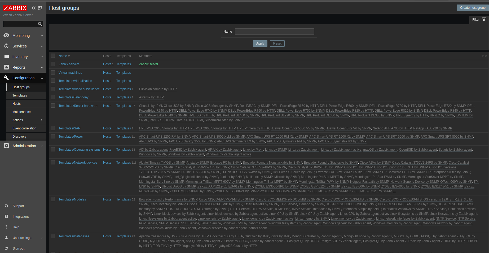
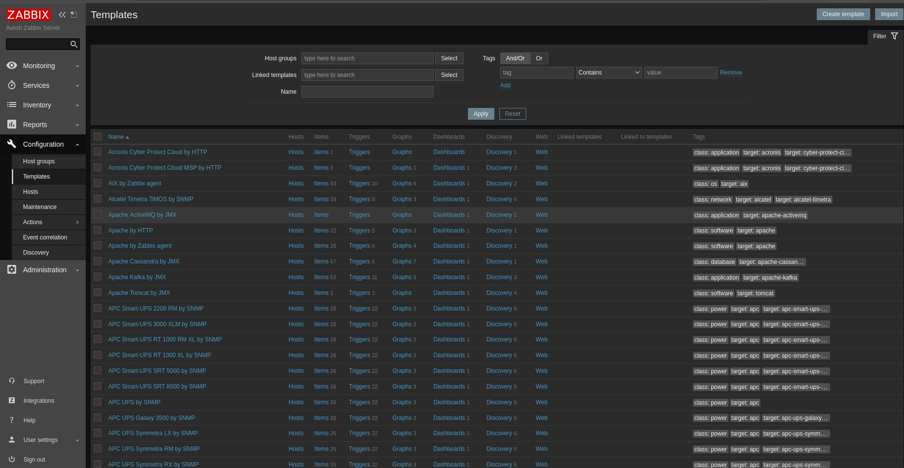
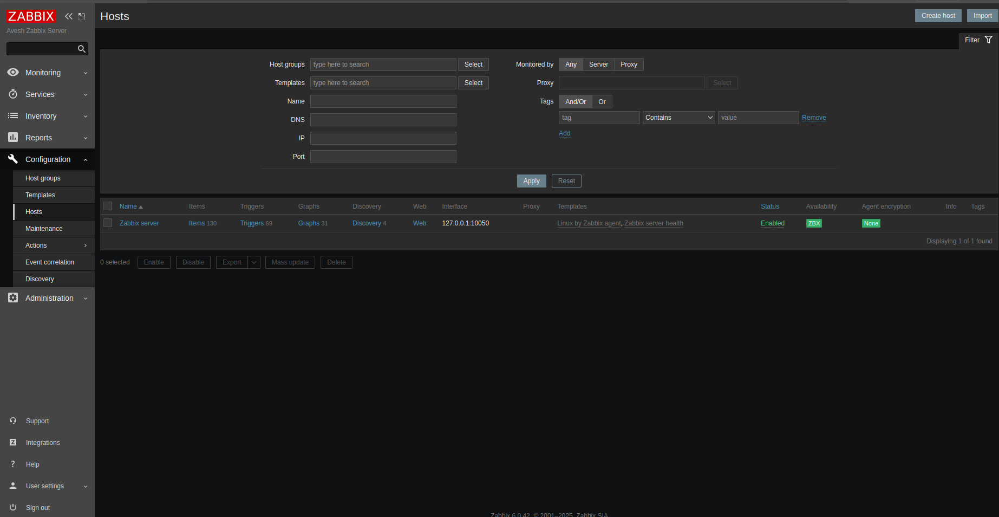
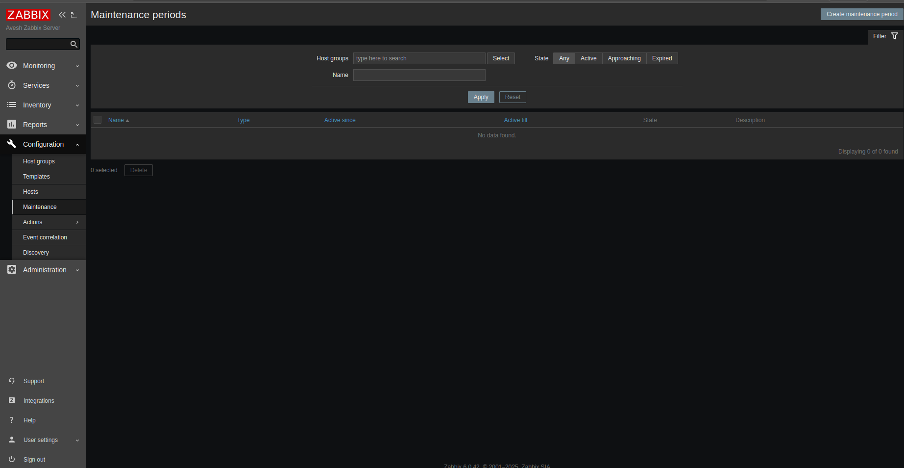
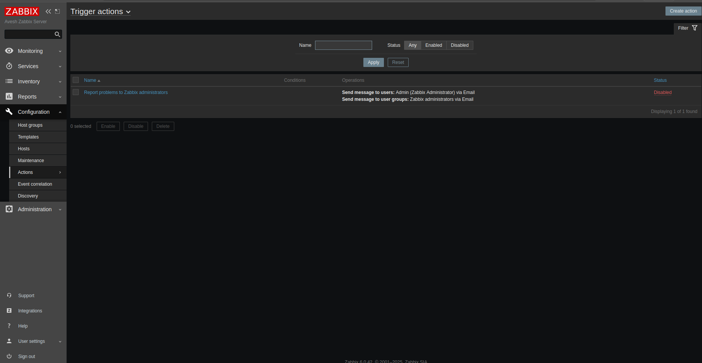
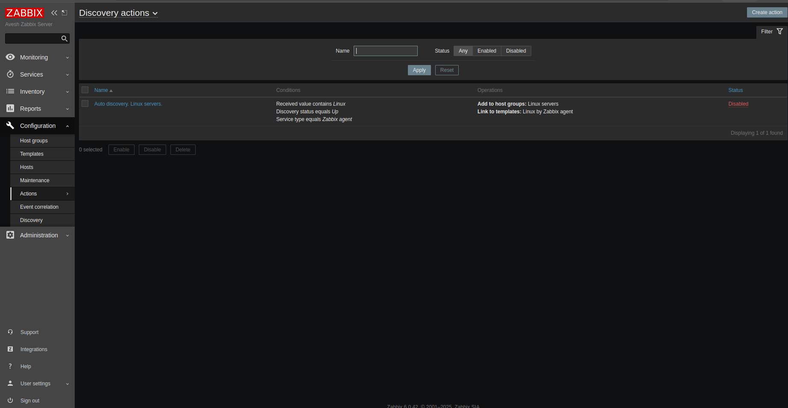
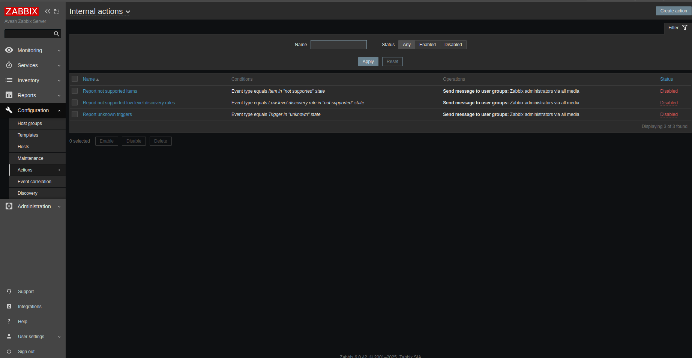
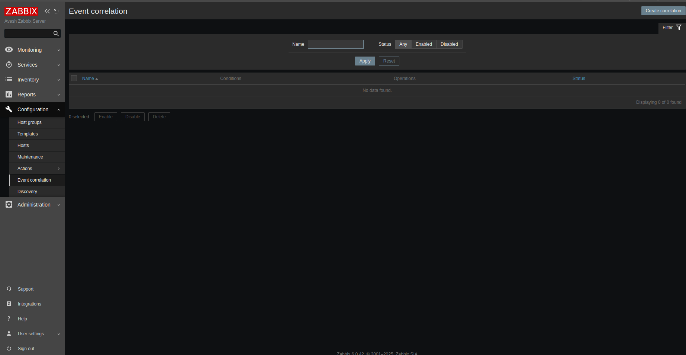
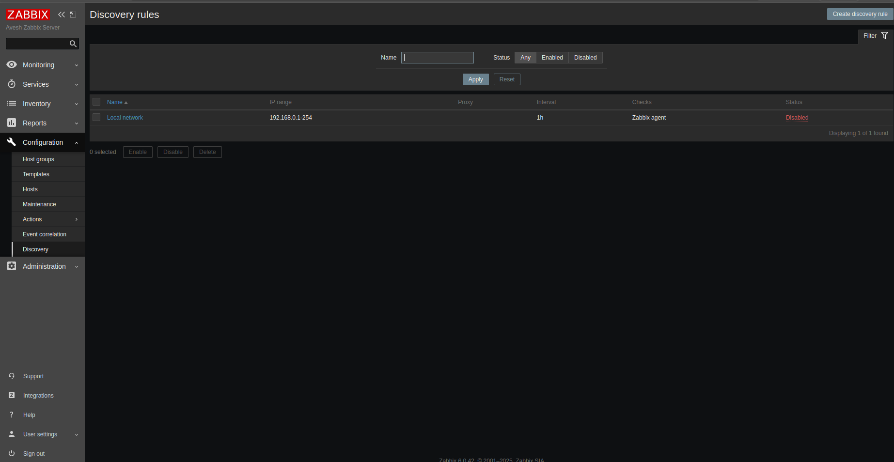

# ⚡ Overview For Zabbix Dashboard
## Reports
├── System information  
├── Scheduled Reports  
├── Availability Report  
├── Trigers top 100  
├── Audit  
├── Action log  
└── Notification

### System information  
- Provides details about the Zabbix server setup including version, database, and other system-level info.

### Scheduled Reports  
- Allows scheduling of custom and predefined reports to be automatically generated and sent to users.

### Availability Report  
- Shows uptime and availability metrics for monitored hosts and services over a selected time period.

### Triggers top 100  
- Lists the top 100 triggers by severity or occurrence, helping prioritize critical issues.

### Audit  
- Contains logs of system events related to user actions, configuration changes, and security-relevant activities.

### Action log  
- Tracks all actions executed by Zabbix, such as notifications sent, remote commands executed, or escalations triggered.

### Notification  
- Displays history and status of notifications sent by Zabbix via different media types to users and groups.

---

## configuration
├── Host Groups  
├── Templates  
├── Hosts  
├── Maintainance  
├── Action  
|   ├── Trigger Action  
|   ├── Discovery Actions  
|   ├── AutoRegistraction Actions  
|   └── Internal Actions  
├── Event Corelation  
└── Discovery

### Host Groups  
- Logical grouping of hosts for easier management and permission control.

### Templates  
- Predefined sets of items, triggers, graphs, and applications to quickly configure hosts.

### Hosts  
- Individual monitored devices or services with specific configurations and assigned templates.

### Maintenance  
- Defines scheduled maintenance periods during which notifications or problem detection are suppressed.

### Action  
- Automation rules triggered by events to perform predefined operations. Includes:  
  - **Trigger Action:** Actions triggered by problem or recovery triggers.  

  
  - **Discovery Actions:** Actions triggered by network or service discovery events.  

  - **AutoRegistration Actions:** Actions executed when new hosts auto-register.  

  - **Internal Actions:** System-level internal actions for notifications and escalations.

### Event Correlation  
- Mechanisms to correlate multiple related events into single actionable issues, reducing alert noise.

### Discovery  
- Automated detection of network devices, hosts, and services using defined rules to streamline monitoring setup.

---
