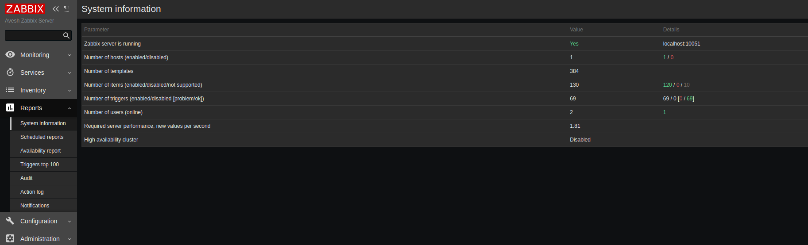
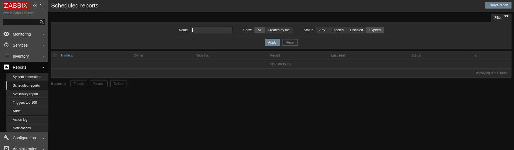
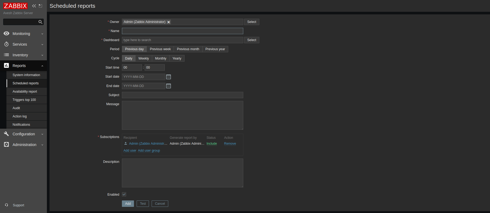
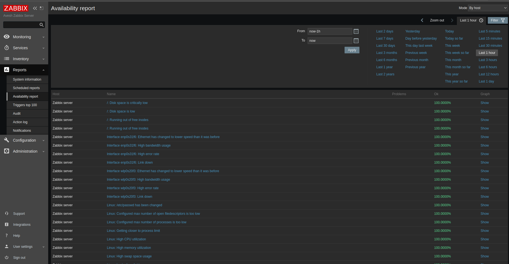
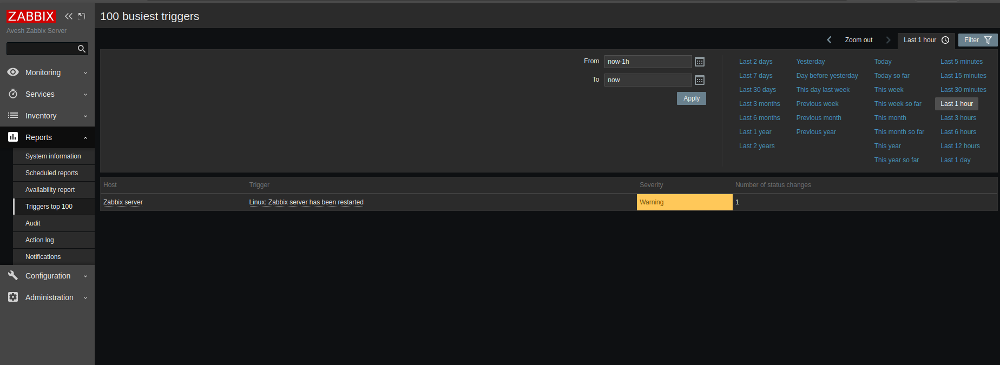
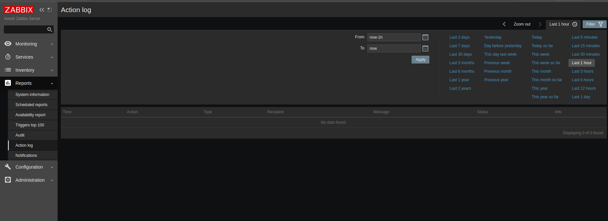
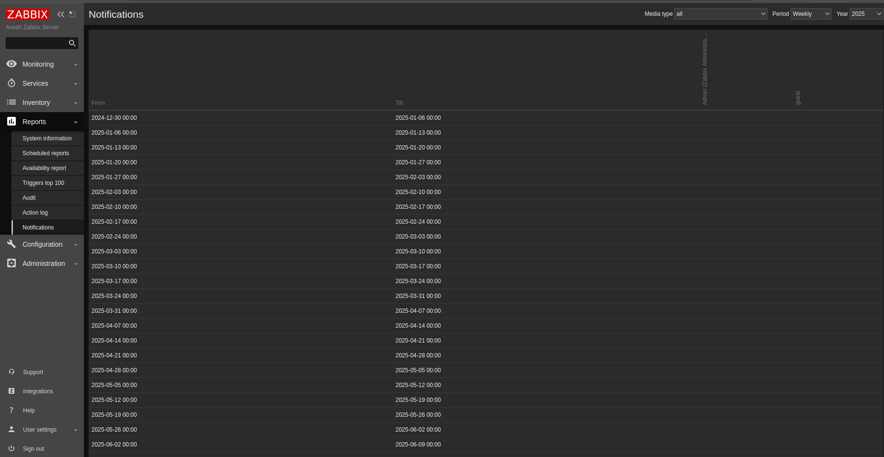

# ⚡ Overview For Zabbix Dashboard
## Reports
├── System information  
├── Scheduled Reports  
├── Availability Report  
├── Trigers top 100  
├── Audit  
├── Action log  
└── Notification

### System information  
- Provides details about the Zabbix server setup including version, database, and other system-level info.

### Scheduled Reports  
- Allows scheduling of custom and predefined reports to be automatically generated and sent to users.

### Availability Report  
- Shows uptime and availability metrics for monitored hosts and services over a selected time period.

### Triggers top 100  
- Lists the top 100 triggers by severity or occurrence, helping prioritize critical issues.

### Audit  
- Contains logs of system events related to user actions, configuration changes, and security-relevant activities.

### Action log  
- Tracks all actions executed by Zabbix, such as notifications sent, remote commands executed, or escalations triggered.

### Notification  
- Displays history and status of notifications sent by Zabbix via different media types to users and groups.

---

